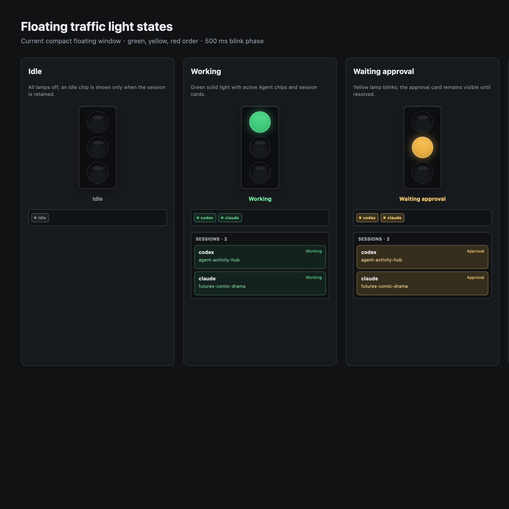
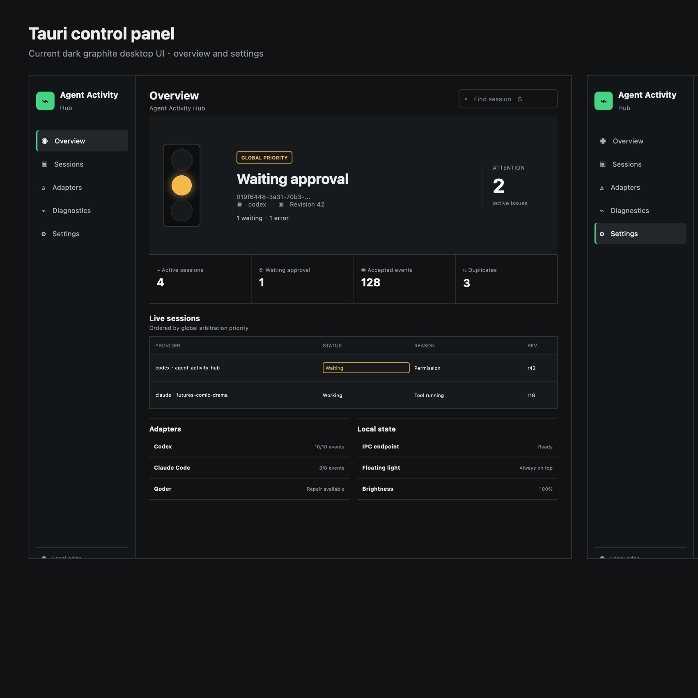

# Agent Activity Hub

[English](README.md) | [简体中文](README-cn.md)

Agent Activity Hub is a local-first Tauri desktop application that combines
Codex, Claude Code, Qoder, and custom agent activity into a session-aware
traffic light. The floating light is the primary output, so the application
works without an external LED device.

```text
Agent hooks and session logs
  -> bundled Rust Hook Helper
  -> Unix Socket (macOS/Linux) or Named Pipe (Windows)
  -> per-session state reducer
  -> global priority arbiter
  -> Tauri control panel and floating traffic light
```

Production activity delivery does not require an HTTP port. The historical
Hook Hub on ports such as `8765` or `8766` is separate from the Tauri state
path and is not required by this application.

## macOS installation

Download the application from [GitHub Releases](https://github.com/VICIy/agent-activity-hub/releases).
The current [Agent Activity Hub v0.1.0](https://github.com/VICIy/agent-activity-hub/releases/tag/v0.1.0)
release includes an Apple Silicon (`arm64`) DMG:

[Download Agent.Activity.Hub_0.1.0_aarch64.dmg](https://github.com/VICIy/agent-activity-hub/releases/download/v0.1.0/Agent.Activity.Hub_0.1.0_aarch64.dmg)

This DMG is not signed or notarized with an Apple Developer ID. Drag the app
to **Applications**, then Control-click it and choose **Open**. If Gatekeeper
still reports that the app is damaged, verify the SHA-256 first and follow the
[unsigned DMG installation guide](docs/macos-unsigned-install-cn.md) to clear
the quarantine attribute and create a local ad-hoc signature. Intel Macs
(`x86_64`) require a separately built Intel package.

### Install through an AI Skill

The repository includes an installation Skill at
[`skills/agent-activity-hub-install/`](skills/agent-activity-hub-install/).
Install that directory into the AI's Skill directory, then invoke it with:

```text
Use $agent-activity-hub-install to install Agent Activity Hub on this Mac.
```

The Skill prefers a GitHub Release, falls back to a source build when no
compatible release exists, and guides the user through installing Codex,
Claude Code, and Qoder hooks in the Tauri control panel.

## Features

- Isolates sessions by `provider + instance_id + session_id`.
- Handles concurrent agents, projects, sessions, and custom providers.
- Shows Agent name, project name, status, and session details in the control
  panel and expandable floating panel.
- Uses the global priority
  `error > waiting approval > complete > working > idle`.
- Keeps approval and error states visible until a real provider event or an
  explicit dismiss action changes them.
- Expires only `complete` automatically, then returns that session to
  `idle`.
- Treats an empty or all-offline session set as global `idle`, so clearing
  the session list leaves every lamp off.
- Lets dismissed sessions reappear when a newer event
  arrives for the same session.
- Supports English and Simplified Chinese.
- Hides the main window on close and keeps the floating light available from
  the macOS tray menu.

## Traffic light

The lamp order is green, yellow, red. The default mapping is:

| State | Default effect | Automatic transition |
|---|---|---|
| Idle | All lamps off | None |
| Working | Green solid | Provider event controls the next state |
| Waiting approval | Yellow blink, 500 ms phase | No automatic idle transition |
| Complete | Green blink, 500 ms phase | Returns to idle after the completion lease |
| Error | Red blink, 500 ms phase | No automatic idle transition |
| Offline / sleeping | All lamps off | Kept only as per-session diagnostic state |

The Settings page can change:

- vertical or horizontal floating-light orientation;
- active lamp mask for each state;
- blink on/off and phase interval;
- global brightness;
- launch at login;
- interface language.

The floating panel uses a compact responsive layout. Active Agent chips wrap
onto additional rows, while expanded session cards show Agent and project
names on separate lines. Red, green, and yellow session cards expose a
dismiss `x`; the control panel's full session list also allows offline entries
to be removed. Dismissal does not suppress future activity from that session.

## Interface and state presentation

### Floating traffic light

The floating window is a transparent, frameless, always-on-top window. It is
horizontal by default, placing the three lamps in one row; vertical mode stacks
them in a column. The bezel is a dark rounded shell, and active lamps use a
matching glow. Blink
effects use a clear step animation with 500 ms on and 500 ms off by default.
The floating window has no shortcut bar. Its compact content is the traffic
light, a wrapping active-Agent strip, and an expand button.

The floating presentation for each state is:

| State | Lamps | Active-Agent strip | Session cards |
|---|---|---|---|
| Idle | All lamps off | Gray `Idle` chip | Hidden by default; gray when retained |
| Working | Solid green | Green Agent chips | Green border and background |
| Waiting approval | Blinking yellow | Yellow Agent chips | Yellow border and background; persistent |
| Complete | Blinking green | Green Agent chips | Green border and background; returns to idle after its lease |
| Error | Blinking red | Red Agent chips | Red border and background; top-right `x` dismiss action |
| Offline / sleeping | All lamps off | Gray diagnostic information | Kept only for diagnostics |

Multiple providers can appear at the same time. Active-Agent chips show the
provider name and session count and wrap onto additional rows when needed.
When the session panel is expanded, its width remains aligned with the light
window. Each compact card has a status dot, Agent name, and status label on the
first line, with the project name on the second line. The dismiss `x` for error,
idle, and offline entries is layered into the top-right corner so it does not
consume text space. Dismissing a card only removes the current presentation;
new events from that session can make it appear again.

### Tauri control panel

The control panel uses a dark graphite interface with green, yellow, and red
status accents. It contains these views:

- **Overview**: large traffic light, global status and provider, attention count,
  event metrics, live sessions, and an adapter summary. Global arbitration is
  `error > waiting approval > complete > working > idle`.
- **Sessions**: a full session table with Agent/session ID, project, status,
  reason, and revision. It includes a back-to-overview button and top-right `x`
  dismissal for visible error, working, approval, complete, idle, and offline
  entries.
- **Adapters**: detect Codex, Claude Code, and Qoder hook configuration; show
  installed event counts, configuration paths, and Helper health; install,
  repair/reinstall, or uninstall managed hooks.
- **Diagnostics**: accepted events, deduplicated events, local IPC readiness,
  and output-test buttons for Working, Waiting approval, Complete, and Error.
- **Settings**: English/Chinese, vertical/horizontal orientation, launch at
  login, and per-state lamp masks, blink toggles, phase intervals, and global
  brightness. Each state is edited in a compact card with a three-lamp preview.

Current floating-light state gallery:



Current Tauri overview and settings views:



## Provider adapters

Open **Adapters** in the Tauri control panel to detect, install, repair, or
uninstall managed hooks.

| Provider | Configuration | Input path |
|---|---|---|
| Codex | `~/.codex/hooks.json` | Native hooks plus structured session-log compensation |
| Claude Code | `~/.claude/settings.json` | Native hooks plus structured session-log compensation |
| Qoder | `~/.qoder/settings.json` | Native hooks; repair removes the legacy `flash4-light.sh` wrapper |

Managed entries are marked with
`work.effective.agent-activity-hub/v1`. Installation preserves unrelated
hooks and top-level settings and writes a backup before replacing a provider
configuration. Codex hooks omit tool matchers and pass each lifecycle event
name explicitly, allowing permission requests and all other managed events to
reach Tauri. Restart the provider after installing or repairing hooks so its
running process loads the new configuration.

The Hook Helper is bundled inside the application. End users do not need this
repository, Python, a private shell wrapper, or a fixed HTTP service.

Repository diagnostics are also available:

```bash
node tools/codex_hooks.mjs doctor
node tools/claude_hooks.mjs doctor
node tools/qoder_hooks.mjs doctor
```

## Development

Prerequisites:

- Rust 1.77 or newer;
- Node.js 22 or newer;
- npm 10 or newer;
- the platform prerequisites for Tauri 2.

```bash
cd apps/agent-activity-desktop
npm install
npm run tauri dev
```

Development starts searching for an available Vite address at
`127.0.0.1:1420`. When that port is occupied, the launcher selects the next
available port and passes the same URL to both Vite and Tauri.

## Production build

```bash
cd apps/agent-activity-desktop
npm run tauri build -- --bundles app
```

Build a macOS DMG:

```bash
npm run tauri build -- --bundles dmg
```

The build compiles the Rust Hook Helper for the active target, copies it into
Tauri's sidecar layout, builds the React frontend, and packages the desktop
application. The macOS application is created at:

```text
target/release/bundle/macos/Agent Activity Hub.app
target/release/bundle/dmg/Agent Activity Hub_0.1.0_aarch64.dmg
```

Launch the packaged application with:

```bash
open -n "target/release/bundle/macos/Agent Activity Hub.app"
```

The macOS bundle includes the rounded application icon and the bundled
`agent-activity-hook` executable.

## Verification

Run the Rust and frontend test suites:

```bash
cargo fmt --all -- --check
cargo test --workspace
cargo clippy --workspace --all-targets -- -D warnings

cd apps/agent-activity-desktop
npm run test -- --run
npm run build
```

With the production Tauri app running, the lifecycle smoke tests send events
through the bundled Hook Helper and inspect the persisted Tauri state. They
cover multiple providers, projects, sessions, serial transitions, concurrent
status arbitration, approval yes/no, persistent errors, completion leases,
offline recovery, and final idle convergence.

```bash
tools/verify_multi_agent_lifecycle.zsh
tools/verify_concurrent_multistate.zsh
```

The scripts require `sqlite3` and `jq`. They refuse to overwrite unrelated
active workflows.

## Repository layout

```text
apps/agent-activity-desktop/       React UI and Tauri shell
native/agent-activity/             protocol, reducer, IPC, storage, Hook Helper
sdk/protocol-schema/               public JSON schemas
fixtures/agent_activity/           redacted provider payload fixtures
tools/                              launchers, hook maintenance, and verification
docs/                               provider and implementation status
```

Runtime data is stored in the platform-specific application data directory.
On macOS:

```text
~/Library/Application Support/work.Effective-Work.Agent-Activity-Hub/
```

The directory contains the SQLite event/state store and the local IPC socket.
Provider payloads are normalized and sensitive tool input is not persisted.

## Generated-file cleanup

The repository ignores `target/`, `dist/`, `node_modules/`, local
databases, and logs. Use the protected cleanup command instead of deleting the
Rust target directory directly:

```bash
node tools/clean_generated.mjs --dry-run
node tools/clean_generated.mjs
```

The cleanup preserves the release application, bundled Hook Helper, sidecar,
and compatibility executables referenced by currently installed provider
hooks.

Further implementation details are available in
[docs/implementation-status.md](docs/implementation-status.md) and
[docs/provider-support.md](docs/provider-support.md).
