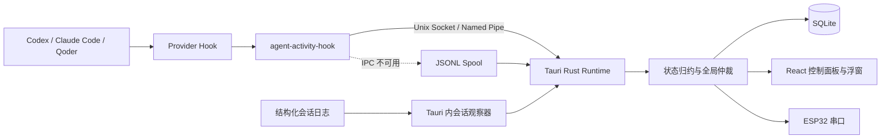

# Agent Activity Hub 架构

本文说明 Agent Activity Hub 的运行时边界、事件链路、核心模块和扩展方式。项目采用
本地优先架构：Provider 事件、状态归约和持久化均在用户设备上完成，不依赖远程服务或
固定 HTTP 端口。

## 系统上下文



生产状态链路不使用历史 Hook Hub 的 `8765`、`8766` 等 HTTP 端口。外接 ESP32 是
可选输出；没有硬件时，控制面板和红绿灯浮窗仍可完整工作。

## 进程与信任边界

系统运行时主要包含三个进程边界：

1. **Agent Provider**：Codex、Claude Code 或 Qoder 触发已安装的 Hook。Provider
   配置属于用户资产，安装器只维护带 `work.effective.agent-activity-hub/v1` 标识的条目。
2. **Hook Helper**：随桌面应用打包的 `agent-activity-hook` 短进程。它解析 Provider
   输入，生成统一事件，并通过本地 IPC 投递；无法投递时写入应用数据目录中的 spool。
3. **桌面应用**：长驻的 Tauri 进程持有状态机、SQLite 连接、本地 IPC 服务、React
   窗口和可选 ESP32 串口连接，是运行时状态的唯一权威写入者。

所有通信默认留在本机。Provider 原始载荷先转换为公共事件模型，敏感工具输入不会进入
SQLite。Hook Helper 设置严格超时，避免阻塞 Provider 的正常工作流。

## 事件处理链路

一次事件按以下顺序处理：

1. Provider Hook 捕获生命周期变化；Tauri 内的会话观察器并行读取结构化日志，用于补偿
   Hook 未覆盖的状态。
2. Hook 路径由 Helper、日志路径由对应观察器将来源数据标准化为 `ActivityEvent`，并补齐
   Provider、实例、会话、项目、事件 ID、时间和来源类型。
3. Helper 连接平台本地 IPC：macOS/Linux 使用 Unix Socket，Windows 使用当前用户的
   Named Pipe；会话观察器则在进程内直接调用 Runtime。
4. Tauri Runtime 验证协议和字段，将事件应用到 `ActivityEngine` 的副本。
5. Runtime 在同一 SQLite 事务中保存事件和新的引擎快照；存储成功后才替换内存状态。
6. Runtime 生成 `StateSnapshot`，通过 `activity://state` 事件通知 React 界面，并把同一
   全局状态同步到已连接的 ESP32。
7. IPC 不可用时，Helper 把事件写入有界 JSONL spool；桌面应用维护循环会轮转、重放，
   仅对可重试的存储错误保留事件。

事件 ID 用于去重。相同事件可以补充更可靠的来源信息，但不会重复推进会话状态。

## 会话状态与全局仲裁

每个会话由以下复合键隔离：

```text
provider + instance_id + session_id
```

单会话归约器将不同 Provider 的事件映射为统一状态。全局仲裁器再从所有有效会话中选择
当前最需要展示的状态，优先级为：

```text
error > waiting_approval > complete > working > idle
```

- `waiting_approval` 与 `error` 保持可见，直到真实 Provider 事件或用户显式移除改变它。
- `complete` 带展示租约，租约到期后该会话回到 `idle`。
- `offline` 与 `sleeping` 保留为单会话诊断状态，不覆盖仍活跃的高优先级会话。
- 没有有效会话时，全局状态为 `idle`，默认三灯全灭。
- 用户移除会话只影响当前可见状态；同一会话产生更新事件后可以重新出现。

## 代码模块

| 模块 | 职责 |
|---|---|
| `activity-protocol` | 公共事件、会话键、枚举、校验和协议版本 |
| `activity-core` | 单会话归约、去重、展示租约和全局优先级仲裁 |
| `activity-ipc` | Unix Socket/Named Pipe 客户端、服务端、握手和业务响应 |
| `activity-store` | SQLite 事件、引擎快照、设置和裁剪策略 |
| `activity-hook` | Provider 输入适配、IPC 投递、超时和 spool 回退 |
| `src-tauri` | Runtime 编排、Hook 配置、会话观察器、Tauri 命令和 ESP32 管理 |
| React 前端 | 总览、适配器、诊断、设置和红绿灯浮窗 |
| `firmware/esp32-traffic-light` | USB/BLE JSON 协议解析、PWM 亮度和三灯输出 |

依赖方向保持为“外层编排依赖内层能力”：协议层不依赖存储或界面，核心状态机不依赖
Tauri，Hook Helper 与桌面 Runtime 复用同一协议和 IPC crate。

## 持久化与恢复

运行时数据位于平台应用数据目录：

```text
Windows: %LOCALAPPDATA%\Effective Work\Agent Activity Hub\data\
macOS:   ~/Library/Application Support/work.Effective-Work.Agent-Activity-Hub/
```

SQLite 保存规范化事件、引擎快照和用户设置。应用启动时从快照恢复状态，定期处理完成租约、
裁剪历史事件并重放 spool。内存引擎只在 SQLite 写入成功后更新，避免界面状态领先于持久化
状态。事件历史默认裁剪到有限数量，spool 也会轮转，防止长期运行导致无界增长。

## 界面通信

React 不直接访问 SQLite 或本地 IPC，而是通过 Tauri command 读取快照、修改设置、管理
Hook 和连接 ESP32。状态变化由 Rust Runtime 主动广播，控制面板与浮窗消费同一份
`StateSnapshot`，因此不会各自计算全局优先级。

灯效映射和亮度同样由 Runtime 持有并持久化。修改设置后，Rust 会广播新的显示配置并立即
用当前全局状态刷新 ESP32。

## ESP32 子系统

桌面端扫描串口并优先标记 Espressif USB 设备。连接后先发送协议握手，随后在状态变化、
灯效设置变化或设备连接时发送逐行 JSON：

```json
{"type":"state","protocol":1,"status":"working","leds":"100","blink":false,"period":500,"brightness":80}
```

`leds` 固定按绿、黄、红排序。固件默认兼容
[GFlash6/minic](https://github.com/GFlash6/minic) ESP32-C3 红绿灯板的 GPIO7 公共阳极和
GPIO10/9/8 阴极接线；硬件来源与实现边界详见
[`firmware/esp32-traffic-light/README-cn.md`](../firmware/esp32-traffic-light/README-cn.md)。
当前桌面应用使用 USB 串口，固件还提供相同消息格式的 BLE Nordic UART Service 接口，
供其他控制器扩展。

## 跨平台实现

| 能力 | macOS/Linux | Windows |
|---|---|---|
| 本地 IPC | Unix Socket | 当前用户 Named Pipe |
| Hook 命令 | POSIX 路径与执行权限 | PowerShell 兼容引用 |
| 桌面分发 | `.app` / DMG | NSIS 安装程序 |
| 串口名称示例 | `/dev/cu.usbmodem…` | `COM3` |

平台差异通过 Rust 条件编译和构建脚本隔离，协议、状态机和存储语义保持一致。CI 分别在
Windows 与 macOS 构建和测试平台代码。

## 扩展指南

### 新增 Provider

1. 在协议适配层把来源事件映射为现有 `ActivityEvent`；只有语义确实新增时才扩展 schema。
2. 为 Provider 定义稳定的 `instance_id`、`session_id` 和事件 ID，避免跨项目串状态。
3. 增加 Hook 配置检测、安装、修复和卸载逻辑，并保留用户的其他配置。
4. 添加脱敏 fixture、归约测试、IPC 投递测试和多 Provider 并发验证。

### 新增输出设备

输出设备应消费 Runtime 已生成的 `StateSnapshot` 和灯效设置，不应自行重新实现状态优先级。
设备失败需要与核心状态机隔离：连接或写入失败可以降级输出，但不能阻断事件持久化与界面
更新。

### 修改状态语义

状态、优先级、租约或去重规则属于 `activity-core`。修改时应同时更新协议 fixture、核心单元
测试、桌面生命周期验证脚本、灯效默认映射和本文档。

## 相关文档

- [Provider 支持矩阵](provider-support.md)
- [实现状态](implementation-status.md)
- [macOS 未签名安装说明](macos-unsigned-install-cn.md)
- [ESP32 固件说明](../firmware/esp32-traffic-light/README-cn.md)
