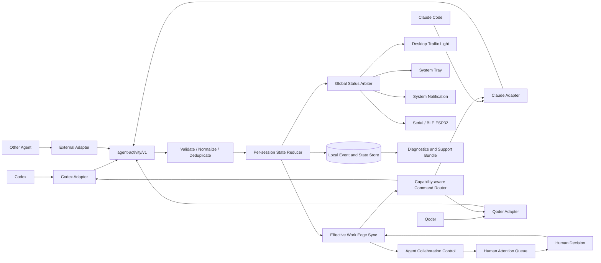

# 多智能体桌面状态中心一体化实施方案

> 项目代号：Agent Activity Hub（暂定）  
> 文档状态：实施方案初稿，可用于技术评审与项目拆分  
> 编写日期：2026-07-13  
> 模块归属：Effective Work / Agent Collaboration Control  
> 运行形态：独立桌面模式 + Effective Work 连接模式  
> 目标平台：macOS 13+、Windows 10/11  
> 首批适配对象：OpenAI Codex、Claude Code、Qoder（接口调研后确认接入等级）

## 1. 执行摘要

Agent Activity Hub 是 Effective Work 的多智能体协作观测与人工干预子模块，同时可以作为本地优先的跨平台桌面应用独立运行。它用统一方式采集多个 AI 编程 Agent 的运行事件，按会话维护状态并进行全局仲裁，再把结果同步到 Effective Work 控制面、桌面红绿灯、系统托盘、系统通知和可选 ESP32 硬件。

产品不把 Codex、Claude 或 Qoder 的原始事件直接映射成灯光，而是在中间建立版本化的标准事件协议：

```text
Agent 原始事件
    -> Provider Adapter
    -> agent-activity/v1 标准事件
    -> Session State Reducer
    -> Global Status Arbiter
    -> Desktop / Tray / Notification / ESP32
```

首版采用 **Tauri 2 + React/TypeScript 桌面层、Rust + Tokio 本地后台核心、独立 Rust Hook Helper、可插拔 Adapter 子进程协议、Effective Work Python 控制面模块**。当前 Python 状态灯 Hub 不立即废弃，而是作为兼容桥接层参与迁移，待标准协议、状态机和跨平台安装验证稳定后再逐步移除。

本地后台是 Agent 事件和控制命令的边缘节点；Effective Work 是持久化、策略、审批和审计控制面。断开 Effective Work 时，桌面状态和硬件输出继续工作，但跨 Agent 编排、集中审批和历史审计进入受限模式。

实施成功的核心判据不是“能亮灯”，而是：

1. 多个 Agent、多窗口、多会话并发时，最终状态可解释且不会互相误覆盖。
2. 等待确认状态能可靠进入和退出，不因日志延迟、重复 watcher 或进程重启而残留。
3. 用户安装一个应用即可完成检测、接入、自启动、升级、诊断和卸载。
4. 桌面软件是主显示端，ESP32 是可选输出端；没有硬件时功能仍完整。
5. 默认不采集提示词、代码正文、工具参数和模型输出内容。
6. 人类可以从 Effective Work 查看注意力队列，并在 Provider 能力允许时批准、拒绝、暂停、恢复或取消 Agent 运行。

## 2. 项目目标与边界

### 2.1 产品目标

1. 在 macOS 和 Windows 桌面持续显示 AI Agent 的全局活动状态。
2. 同时支持 Codex、Claude Code、Qoder，并允许后续接入 Cursor、Windsurf、Gemini CLI、Aider 等工具。
3. 为每个 Provider、实例和会话展示独立状态、最近事件和异常原因。
4. 对等待确认、运行失败、任务完成提供明确且低干扰的视觉反馈。
5. 通过一个安装包管理后台核心、Hook Helper、Adapter、托盘、浮动窗口和设备连接。
6. 提供公开、稳定、版本化的本机事件协议和 Adapter SDK。
7. 作为 Effective Work 的 Agent Collaboration Control 子模块，形成“观察、决策、执行、审计”人工干预闭环。

### 2.2 技术目标

- 后台核心不依赖具体 Agent 的事件命名和日志格式。
- 原生 Hook、官方 API、日志监听和启发式检测可以并存，并有明确可信度优先级。
- 所有输入事件可去重、可关联、可审计、可回放。
- 单实例由操作系统锁或 IPC 端点保证，不依赖会过期的普通锁文件。
- 多会话监听并行运行，不采用“只跟踪最新文件”的全局切换模式。
- Hook Helper 冷启动快、始终退出 0，状态软件故障不能阻塞 Agent。
- 桌面 UI 与设备输出只消费标准状态，不包含 Provider 特例。
- 支持从当前 Python Hub 平滑迁移和快速回滚。
- 本地边缘节点与 Effective Work 控制面通过版本化协议连接，网络中断不影响本地 Agent。
- 所有干预命令基于 Provider capability 执行，使用幂等键、预期 revision 和完整审计记录。

### 2.3 非目标

首版明确不做：

- 读取或展示完整提示词、模型回复和源代码内容。
- 绕过 Provider 官方确认机制、模拟界面点击或伪造批准结果。
- 远程监控团队成员、跨设备云同步或集中式管理后台。
- 依靠屏幕识别判断 Agent 状态。
- 允许未经审核的 Adapter 在主进程内加载原生动态库。
- 假设所有 IDE 和 Agent 都具备相同控制能力；无法控制的 Provider 只提供观测和导航。
- 一开始就删除已经验证可用的 Python Hub 和设备传输实现。

### 2.4 Effective Work 子模块定位

这里的“子模块”指 Effective Work 模块化单体中的一个 bounded context，以及与其配套的本地桌面边缘节点，不建议使用 Git submodule 管理代码。

模块职责分为两部分：

- **Local Agent Activity Edge**：运行在用户电脑，接入本机 Agent，维护实时状态，执行经过授权的控制命令，驱动桌面和硬件输出。
- **Agent Collaboration Control**：运行在 Effective Work 后端，持久化标准事件和状态，生成注意力队列，执行策略与审批，记录人工干预审计。

Effective Work 不直接解析 Codex、Claude 或 Qoder 的私有日志格式；Provider 特例必须留在本地 Adapter。桌面边缘节点也不自行决定高风险操作是否可批准；它只验证并执行控制面签发且 Provider 支持的命令。

完整服务端领域模型、API 和一致性规则见 [第 22 章](#22-effective-work-集成设计)。

## 3. 用户场景与功能需求

### 3.1 核心用户场景

#### 场景 A：单 Agent 工作

1. 用户向 Codex 提交任务。
2. 桌面绿灯进入工作状态。
3. Codex 请求 Shell 权限，黄灯持续闪烁。
4. 用户处理确认后，黄灯解除并恢复绿灯。
5. 任务完成，绿灯快速闪烁后进入空闲。

#### 场景 B：多 Agent 并发

1. Codex 正在执行工具，Claude Code 等待确认，Qoder 已完成任务。
2. 应用分别保存三个会话状态。
3. 全局状态按优先级显示“等待确认”。
4. 用户打开托盘面板，可以看到等待来自 Claude Code 的具体会话。
5. Claude Code 恢复后，全局状态重新计算，而不是简单采用最后到达的事件。

#### 场景 C：无硬件使用

1. 用户只安装桌面应用，不连接 ESP32。
2. 浮动红绿灯和托盘图标提供完整状态反馈。
3. 设备模块显示“未配置”，不影响核心健康状态。

#### 场景 D：应用未运行时收到 Hook

1. Agent 调用轻量 Hook Helper。
2. Helper 发现后台 IPC 不可用。
3. Helper 静默启动桌面应用后台模式，并在短超时内重试一次。
4. 仍失败时将事件写入有界本地 spool 后退出 0。
5. 后台启动后读取 spool，按事件 ID 去重并补处理。

#### 场景 E：人类干预多智能体协作

1. Codex 等待高风险 Shell 权限，Claude Code 正在运行，Qoder 因工具错误停止。
2. Effective Work 把三者聚合为一个按风险和时效排序的注意力队列。
3. 用户打开待干预项，查看 Provider、会话、风险级别、请求能力和脱敏上下文。
4. 对支持远程响应的 Provider，用户在 Effective Work 中批准或拒绝；不支持时跳转到原 Agent 确认界面。
5. 控制命令由本地边缘节点执行并返回 acknowledgement，Effective Work 记录决策人、时间、结果和失败原因。

### 3.2 功能需求

| 编号 | 需求 | 优先级 |
|---|---|---:|
| FR-001 | 自动检测已安装的 Agent 和可用接入方式 | P0 |
| FR-002 | 接收并校验 `agent-activity/v1` 标准事件 | P0 |
| FR-003 | 按 Provider、实例、会话维护独立状态 | P0 |
| FR-004 | 对多会话执行全局状态优先级仲裁 | P0 |
| FR-005 | 提供桌面浮动红绿灯和系统托盘 | P0 |
| FR-006 | 支持等待确认、工作、完成、错误、空闲和离线状态 | P0 |
| FR-007 | 支持 Codex 原生 Hook 与 session JSONL | P0 |
| FR-008 | 支持 Claude Code 原生 Hook | P0 |
| FR-009 | 完成 Qoder 接口调研并实现可达到的最高等级适配 | P1 |
| FR-010 | 支持串口 ESP32 输出 | P1 |
| FR-011 | 支持 BLE ESP32 输出 | P1 |
| FR-012 | 提供 Adapter 安装、启停、健康检查和卸载 | P1 |
| FR-013 | 提供诊断页面、事件时间线和支持包导出 | P1 |
| FR-014 | 支持登录启动、自动更新和配置迁移 | P1 |
| FR-015 | 提供外部 Adapter SDK 和通用 Hook 接口 | P2 |
| FR-016 | 向 Effective Work 同步脱敏标准事件、状态快照和 capability | P0 |
| FR-017 | 提供跨 Provider 的人工注意力队列 | P0 |
| FR-018 | 支持幂等的 approve/reject/pause/resume/cancel 干预命令 | P1 |
| FR-019 | Provider 不支持控制时提供定位和跳转，不伪造成功 | P0 |
| FR-020 | 对每次人工干预建立决策、派发、执行和结果审计链 | P0 |

### 3.3 非功能需求

| 编号 | 指标 | 目标 |
|---|---|---|
| NFR-001 | Hook Helper P95 执行时间 | 后台已运行时小于 50 ms |
| NFR-002 | 事件到桌面状态 P95 延迟 | 小于 200 ms |
| NFR-003 | 后台空闲内存 | 目标小于 80 MB，不含 WebView 渲染进程 |
| NFR-004 | 空闲 CPU | 目标小于 1%，不使用高频全目录轮询 |
| NFR-005 | 事件重复处理 | 同一事件最多产生一次状态转换和一次设备命令 |
| NFR-006 | Hook 故障隔离 | 任何错误均退出 0，不阻塞 Agent |
| NFR-007 | 本地暴露 | IPC 默认仅当前用户可访问；HTTP 兼容端口默认关闭 |
| NFR-008 | 日志隐私 | 默认不记录 prompt、代码正文、工具参数和模型输出 |
| NFR-009 | 稳定性 | 24 小时并发会话 soak test 无重复后台实例和残留等待锁 |
| NFR-010 | 离线安全 | Effective Work 不可达时本地 Agent 不阻塞，高风险命令不自动放行 |
| NFR-011 | 干预幂等 | 相同 command ID 最多执行一次，重复派发返回原结果 |

## 4. 总体架构

### 4.1 逻辑架构



### 4.2 进程架构

正式制品包含两个必需可执行文件和若干可选 Adapter：

| 进程 | 生命周期 | 职责 |
|---|---|---|
| `agent-activity` | 登录后常驻 | Tauri 主进程、状态核心、内置 Adapter、UI、设备输出 |
| `agent-activity-hook` | 每个 Hook 短暂启动 | 读取 stdin、转换信封、发送 IPC、退出 0 |
| `adapter-*` | 按配置由主进程托管 | 外部 Agent 适配器，以 JSONL/IPC 与主进程通信 |

桌面窗口关闭时只隐藏窗口，后台核心和托盘继续运行。用户从托盘选择“退出”时才结束主进程。

### 4.3 核心数据流

```text
Raw Event
  -> Adapter mapping
  -> Schema validation
  -> Event ID and correlation normalization
  -> Source-priority deduplication
  -> Per-session reduction
  -> Global arbitration
  -> Output diff calculation
  -> Broadcast only changed outputs
```

输出端不重新解释原始事件，只接收如下状态快照：

```json
{
  "status": "waiting_approval",
  "provider": "claude-code",
  "session_id": "session-123",
  "since": "2026-07-13T14:00:00Z",
  "revision": 42
}
```

### 4.4 独立模式与 Effective Work 连接模式

桌面边缘节点支持两种运行模式，使用同一状态核心：

| 模式 | 本地状态/灯光 | Effective Work 同步 | 人工干预 |
|---|---:|---:|---:|
| Standalone | 完整 | 无 | 只导航到 Provider 原界面 |
| Connected | 完整 | 脱敏事件、状态和 capability | 通过控制面决策并由本地 Adapter 执行 |

Connected 模式的数据流是双向的：

```text
Local Edge -- activity events / state snapshots --> Effective Work
Local Edge <-- intervention commands / policy ---- Effective Work
Local Edge -- command acknowledgements ----------> Effective Work
```

本地边缘节点始终是 Provider 与设备连接的所有者。Effective Work 后端不直接访问用户电脑上的 session 文件、串口、BLE 或 Agent IPC。

## 5. 标准事件协议

### 5.1 协议原则

1. Provider Adapter 输出语义事件，不输出颜色或动画名称。
2. Schema 必须版本化；新增可选字段保持向后兼容。
3. 时间字段区分事件发生时间和本机观察时间。
4. Provider 无法提供的 ID 由 Adapter 稳定派生，不使用随机值破坏去重。
5. 默认 attributes 只能包含非敏感元数据。
6. 原始 Provider payload 仅在显式诊断模式短暂保留，并执行字段脱敏。

### 5.2 事件结构

```json
{
  "schema_version": "1.0",
  "event_id": "codex:session-123:call-456:approval-required",
  "provider": "codex",
  "adapter_id": "builtin.codex",
  "adapter_version": "0.1.0",
  "source_kind": "native_hook",
  "instance_id": "codex-desktop",
  "session_id": "session-123",
  "turn_id": "turn-234",
  "correlation_id": "call-456",
  "sequence": 18,
  "kind": "approval.required",
  "occurred_at": "2026-07-13T14:00:00.120Z",
  "observed_at": "2026-07-13T14:00:00.142Z",
  "tool": {
    "name": "shell_command",
    "category": "execution"
  },
  "attributes": {
    "permission_scope": "sandbox_escalation"
  }
}
```

### 5.3 标准事件类型

| 事件 | 含义 | 典型状态影响 |
|---|---|---|
| `adapter.connected` | Adapter 可用 | 更新连接健康度 |
| `adapter.disconnected` | Adapter 不可用 | Provider 无其他来源时进入离线 |
| `session.started` | 会话开始或恢复 | `idle` |
| `session.stopped` | 会话结束 | 清理该会话所有临时状态 |
| `user.prompted` | 用户提交新输入 | `working` |
| `model.working` | 模型思考或生成 | `working` |
| `tool.started` | 工具开始 | `working` |
| `tool.finished` | 工具正常结束 | 解除关联等待并回到 `working` |
| `tool.failed` | 工具失败 | `error` |
| `approval.required` | 等待用户确认 | `waiting_approval` |
| `approval.resolved` | 批准、拒绝或取消 | 解除关联等待 |
| `run.completed` | 本轮完成 | `complete` |
| `run.failed` | 本轮失败 | `error` |
| `heartbeat` | 会话或 Adapter 存活 | 刷新 lease，不直接改状态 |

### 5.4 ID 与关联规则

- `event_id`：用于幂等去重，必须在同一 Provider 事件上稳定。
- `session_id`：状态隔离的最低边界，缺失时使用 `instance_id + adapter session key` 派生。
- `turn_id`：可选，用于区分同一会话的多轮任务。
- `correlation_id`：工具调用或批准请求的关联键，优先使用 `call_id`。
- `sequence`：Provider 能提供时使用；不能提供时由 Adapter 为单个 session 单调生成。

等待状态优先按 `provider + instance_id + session_id + correlation_id` 解除。Provider 不提供 correlation ID 时，允许同一 session 的明确恢复事件解除，但不得由其他 session 的事件解除。

### 5.5 来源优先级与去重

同一语义事件可能同时来自原生 Hook 和日志 watcher。默认可信度如下：

```text
native_hook      400
official_api     300
session_log      200
process_heuristic 100
```

去重键优先级：

1. Provider 原生 event ID。
2. `provider + session_id + correlation_id + kind`。
3. `provider + session_id + sequence + kind`。
4. 受限时间窗口内的内容指纹，仅作为最后回退。

高优先级来源到达时可以补充低优先级事件的元数据，但不得重复触发状态变化和设备输出。

### 5.6 干预命令协议

活动事件描述“发生了什么”，干预命令描述“人类希望系统做什么”。两者分开版本化，命令示例：

```json
{
  "schema_version": "1.0",
  "command_id": "cmd-019f...",
  "kind": "approval.approve",
  "provider": "codex",
  "instance_id": "codex-desktop",
  "session_id": "session-123",
  "correlation_id": "call-456",
  "expected_revision": 42,
  "issued_by": "user-1",
  "issued_at": "2026-07-13T14:05:00Z",
  "expires_at": "2026-07-13T14:10:00Z",
  "reason": "User approved the requested repository operation."
}
```

标准命令类型：

| 命令 | 所需 capability | 说明 |
|---|---|---|
| `approval.approve` | `approval.respond` | 批准当前关联请求 |
| `approval.reject` | `approval.respond` | 拒绝当前关联请求 |
| `run.pause` | `run.pause` | 在 Provider 支持的安全点暂停 |
| `run.resume` | `run.resume` | 恢复已暂停运行 |
| `run.cancel` | `run.cancel` | 请求协作式取消 |
| `session.focus` | `session.focus` | 打开或聚焦 Provider 原生界面 |
| `message.send` | `message.send` | 后续能力，首版默认关闭 |

本地执行前必须验证 command ID、目标 session、有效期、expected revision、capability 和本地用户绑定。执行结果返回 acknowledgement：

```json
{
  "command_id": "cmd-019f...",
  "status": "succeeded",
  "executed_at": "2026-07-13T14:05:01Z",
  "provider_result": "accepted",
  "result_event_id": "codex:session-123:call-456:approval-resolved"
}
```

`unsupported`、`stale`、`expired`、`rejected_by_policy` 和 `failed` 必须作为一等结果，不能转成伪成功。

## 6. 会话状态机与全局仲裁

### 6.1 会话状态

```text
offline
idle
working
waiting_approval
complete
error
sleeping
```

每个状态记录：

- `entered_at`
- `last_event_at`
- `source_event_id`
- `active_correlation_ids`
- `lease_expires_at`
- `reason`
- `revision`

### 6.2 状态转换规则

| 当前状态 | 事件 | 新状态 |
|---|---|---|
| 任意 | `approval.required` | `waiting_approval` |
| `waiting_approval` | 匹配的 `approval.resolved` | `working` |
| `waiting_approval` | 匹配的 `tool.finished/tool.failed` | `working/error` |
| `waiting_approval` | 同会话明确恢复的 `model.working` | `working` |
| 任意非错误 | `tool.failed/run.failed` | `error` |
| `working` | `run.completed` | `complete` |
| `complete` | 完成展示 lease 到期 | `idle` |
| `error` | 错误展示 lease 到期或用户确认 | `idle` |
| 任意 | `session.stopped` | 移除会话或进入 `offline` |

等待状态不能只依赖固定 TTL 解除。TTL 仅作为崩溃后的最后保护，并且到期前必须检查：

1. Adapter 是否仍在线。
2. 会话文件是否仍存在且持续更新。
3. 是否已出现同 correlation ID 的结束事件。
4. 是否已有同会话后续事件证明模型恢复。

### 6.3 全局优先级

默认全局优先级：

```text
error              500
waiting_approval   400
working            300
complete           200
idle               100
offline/sleeping     0
```

同优先级有多个会话时，优先显示最近进入该状态的会话；托盘面板展示所有同级会话。错误和完成状态使用短展示 lease，lease 期间严格应用灯效映射，到期后进入空闲，避免历史终态永久遮挡其他会话。

### 6.4 重启恢复

主进程启动时：

1. 加载最后一次持久化状态快照。
2. 启动 Adapter 并获取其健康状态。
3. 对支持回放的 Provider 读取有限事件尾部。
4. 以 `event_id` 去重后重建未完成的 approval/tool correlation。
5. 无法验证的等待状态标记为 `stale`，不直接点亮黄灯，先显示诊断提示。

## 7. Adapter 架构

### 7.1 接入等级

| 等级 | 接入方式 | 可靠性 | 使用原则 |
|---|---|---:|---|
| L1 | 原生生命周期 Hook | 最高 | 首选，负责实时事件 |
| L2 | 官方 API 或 IDE Extension API | 高 | 无 Hook 时使用 |
| L3 | 稳定 session/transcript/log | 中 | 负责回放和补偿 |
| L4 | 进程、端口或窗口启发式 | 低 | 只判断在线，不生成审批等强语义事件 |

一个 Provider 可以同时启用多个等级，但必须由 Adapter 内部或核心去重。

### 7.2 Adapter 生命周期

```text
detect
  -> inspect
  -> install
  -> start
  -> health
  -> stop
  -> uninstall
```

| 操作 | 说明 |
|---|---|
| `detect` | 检测安装路径、版本和可用接入等级 |
| `inspect` | 只读检查现有配置，生成变更预览 |
| `install` | 备份并合并 Hook/扩展配置 |
| `start` | 开始监听或连接 Provider |
| `health` | 返回在线、延迟、最后事件和错误 |
| `stop` | 停止监听，不删除配置 |
| `uninstall` | 只移除本应用拥有的配置片段 |

### 7.3 外部 Adapter 协议

外部 Adapter 作为子进程运行，通过 stdin/stdout JSONL 或本机 IPC 通信，避免 Rust 动态库 ABI：

```json
{"type":"adapter.ready","adapter_id":"community.example","protocol":"1.0"}
{"type":"activity.event","event":{"schema_version":"1.0","event_id":"..."}}
{"type":"adapter.health","status":"ok","last_event_at":"..."}
```

主进程负责启动、超时、重启退避、日志收集和资源限制。Adapter 不直接访问桌面 UI 或设备。

### 7.4 Codex Adapter

输入：

- `~/.codex/hooks.json` 原生 Hook。
- `~/.codex/sessions/**/*.jsonl` 多文件 watcher，作为补偿和无 Hook 主机的回退。

实施要求：

1. Hook Helper 解析 `SessionStart`、`UserPromptSubmit`、`PreToolUse`、`PermissionRequest`、`PostToolUse`、`Stop` 等事件。
2. watcher 同时维护多个活动文件游标，不在文件之间全局切换。
3. 原生 Hook 与 JSONL 通过 session/call/event ID 去重。
4. Hook 配置采用结构化 JSON 合并，并保留备份和 ownership marker。

### 7.5 Claude Code Adapter

输入优先级：

1. Claude Code 原生 Hook。
2. transcript/session 数据作为补偿源。

实施要求：

- 将 Claude 事件映射到同一标准类型，不复用 Codex 事件名作为核心协议。
- 安装器只修改自己拥有的 Hook 条目。
- Claude 和 Codex 可以同时运行，共享同一个核心和设备输出所有者。

### 7.6 Qoder Adapter

Qoder 接入必须先完成兼容性 Spike，不预设其一定提供稳定 Hook。调研顺序：

1. 是否公开生命周期 Hook 或本机 API。
2. 是否支持 IDE Extension API 或命令扩展。
3. 是否存在稳定、可关联 session 的本地日志。
4. 是否能从公开进程、端口或窗口状态判断在线。
5. macOS 与 Windows 的事件能力是否一致。

Spike 输出：

- 支持矩阵与版本范围。
- 样例事件和脱敏 fixture。
- 最高可达到的接入等级。
- 无法可靠识别的状态列表。
- 版本变化检测和降级策略。

若只能达到 L3/L4，UI 必须标明“推断状态”，不能把推断的等待确认显示为确定事件。

### 7.7 Generic Hook Adapter

提供一个通用命令，允许其他 Agent 发送标准事件：

```bash
agent-activity-hook emit \
  --provider my-agent \
  --session session-1 \
  --kind model.working
```

也支持从 stdin 读取 Provider 原始 payload，并由配置文件执行字段映射。通用映射不能执行任意脚本表达式，避免配置成为代码执行入口。

## 8. 后台核心设计

### 8.1 Rust crate 拆分

| crate | 职责 |
|---|---|
| `activity-protocol` | Schema、枚举、版本兼容和序列化 |
| `activity-core` | 去重、会话 reducer、全局 arbiter、lease |
| `activity-ipc` | Unix Socket、Windows Named Pipe、客户端认证 |
| `activity-adapter-runtime` | 内置/外部 Adapter 生命周期与健康检查 |
| `activity-store` | 配置、事件环形存储、状态快照、迁移 |
| `activity-device` | Serial、BLE、重连和设备命令 |
| `activity-hook` | 短生命周期 Hook Helper |
| `activity-desktop` | Tauri command、tray、window 和 updater |

### 8.2 Tokio 任务模型

主进程使用一个 Tokio runtime，按职责启动受控任务：

```text
supervisor
├── ipc_server
├── adapter_manager
│   ├── codex_adapter
│   ├── claude_adapter
│   └── qoder_adapter
├── event_pipeline
├── state_persistence
├── output_dispatcher
│   ├── desktop_output
│   ├── tray_output
│   └── device_output
└── diagnostics
```

所有任务通过有界 channel 通信。退出时 supervisor 先停止输入，再排空事件管道，最后关闭输出和存储。单个 Adapter 崩溃不得导致主进程退出。

### 8.3 IPC

默认使用当前用户可访问的本机 IPC：

- macOS：Unix Domain Socket，位于应用支持目录。
- Windows：Named Pipe，例如 `\\.\pipe\agent-activity-v1-<user>`。

IPC 请求包含协议版本、客户端类型和随机 nonce。Hook Helper 设置严格连接与写入超时。兼容当前 Python Hub 的 localhost HTTP 端口仅在迁移模式启用。

### 8.4 单实例

单实例同时使用：

1. Tauri single-instance 机制，处理重复启动和唤起窗口。
2. OS 文件锁/Named Mutex，保护后台核心。
3. IPC 端点所有权校验，防止连接到其他用户进程。

禁止以“锁文件年龄超过 N 秒”作为强制抢锁条件。只有确认 owner PID 已终止或 OS 锁自动释放后才能接管。

### 8.5 本地存储

首版使用 SQLite 或嵌入式 KV 保存：

- 配置和 schema version。
- Adapter 安装 ownership 和备份路径。
- 最近有限数量的脱敏标准事件。
- 会话状态快照和未完成 correlation。
- 窗口位置、显示器和 UI 偏好。
- 设备选择和灯效配置。

事件存储默认保留 7 天或 10,000 条，先达到者触发清理。用户可以关闭事件历史，只保留当前状态。

## 9. 桌面应用设计

### 9.1 窗口

浮动红绿灯窗口要求：

- 透明、无边框、始终置顶。
- 可拖动并记住每个显示器的位置。
- 支持点击穿透和锁定位置。
- 三灯具有稳定尺寸，动画不能改变布局。
- 点击灯体打开会话面板，不在灯体中堆叠说明文字。
- 系统缩放 100% 至 200% 下保持清晰。

### 9.2 托盘

托盘菜单至少包含：

- 当前全局状态和来源 Provider。
- 等待确认会话列表。
- 显示/隐藏浮动灯。
- 点击穿透、始终置顶和开机启动开关。
- Adapter 与设备状态。
- 诊断、重启后台、退出。

### 9.3 管理面板

管理面板采用工作台布局，不使用营销式首页。主要视图：

1. **Overview**：全局状态、活动会话、Adapter 健康和设备状态。
2. **Sessions**：按 Provider 分组的会话状态与最近事件。
3. **Adapters**：检测、安装、修复、停用和卸载。
4. **Outputs**：桌面灯、托盘、通知、Serial、BLE。
5. **Diagnostics**：去重统计、事件延迟、错误和支持包。
6. **Settings**：启动、隐私、保留期、灯效和更新渠道。

### 9.4 默认灯效

| 状态 | 桌面灯 | ESP32 |
|---|---|---|
| `idle` | 全灭或绿色低亮 | `000` 或可配置低亮 |
| `working` | 绿色常亮/轻呼吸 | 绿色常亮 |
| `waiting_approval` | 黄色 420 ms 闪烁 | 黄色闪烁 `010` |
| `complete` | 绿色短闪 | 绿色短闪 |
| `error` | 红色 220 ms 闪烁 | 红色闪烁 `001` |
| `offline` | 黄色慢速巡航或灰色 | 可配置为熄灭 |
| `sleeping` | 全灭 | `000` |

灯效是输出配置，不进入标准事件协议。

## 10. 设备输出

### 10.1 输出所有权

任意时刻只有主进程的 `device_output` 可以持有串口或 BLE 连接。Adapter、Hook Helper、兼容 Python Hub 均不得在正式模式直接写设备。

迁移期如果 Python Hub 仍拥有设备，新核心只能运行 shadow mode，不得并行发送灯光命令。

### 10.2 Serial

- 扫描 CH340/CH341、CP210、Espressif VID 和 USB CDC/JTAG 特征。
- 默认自动选择高可信设备，允许用户固定选择。
- 长连接持有端口，断开后指数退避重连。
- 串口监视器占用时提供明确诊断，不循环高频重试。

### 10.3 BLE

- 支持 Nordic UART Service。
- macOS 配置 Bluetooth usage description。
- Windows 处理蓝牙权限、设备缓存和地址变化。
- BLE 与 Serial 可以 fallback 或 parallel，但默认只选择一个成功通道。

## 11. 安装、升级与卸载

### 11.1 安装包内容

```text
Agent Activity Hub
├── agent-activity
├── agent-activity-hook
├── built-in adapters
├── webview assets
├── licenses
└── optional migration helper
```

### 11.2 macOS

- 产物：Universal 或分别提供 Apple Silicon / Intel 的 `.app` 和 `.dmg`。
- 应用路径：`/Applications/Agent Activity Hub.app`。
- Hook Helper：应用包 `Contents/MacOS/agent-activity-hook`。
- 数据目录：`~/Library/Application Support/Agent Activity Hub/`。
- 登录启动：Tauri autostart 或受控 LaunchAgent，二选一，不能重复注册。
- 发布要求：Developer ID 签名、Hardened Runtime、Notarization、Stapling。

### 11.3 Windows

- 产物：NSIS 或 MSI，首版优先用户级安装。
- 应用路径：`%LOCALAPPDATA%\Programs\Agent Activity Hub\`。
- 数据目录：`%LOCALAPPDATA%\Agent Activity Hub\`。
- 登录启动：用户级注册表启动项或 Tauri autostart，二选一。
- 发布要求：代码签名、WebView2 检测、SmartScreen 信誉说明。

### 11.4 Hook 配置管理

安装 Adapter 前必须：

1. 读取并验证现有配置。
2. 生成结构化 diff 给用户确认。
3. 写入带 ownership marker 的独立条目。
4. 原子替换并保存时间戳备份。
5. 安装后运行一次 hook doctor。

卸载时只删除 ownership marker 匹配的条目；配置已经被用户修改时停止自动删除并提供人工处理说明。

### 11.5 升级

- 协议、配置和数据库 schema 各自版本化。
- Hook Helper 路径在升级后保持稳定。
- 更新前验证 Adapter 配置可迁移。
- 更新失败自动回滚应用二进制，不回滚用户事件和设置。
- Adapter 可以独立更新，但必须声明兼容的核心协议范围。

## 12. 安全与隐私

### 12.1 数据最小化

默认允许记录：

- Provider、版本、事件类型。
- session/turn/call 的不可逆或非内容标识。
- 工具名称和工具分类。
- 状态时间、延迟和错误码。

默认禁止记录：

- prompt 和模型回复正文。
- Shell 命令和工具参数。
- 文件内容、补丁内容和源代码。
- API key、token、cookie 和环境变量。

### 12.2 IPC 安全

- IPC 端点仅当前用户可访问。
- 不监听 `0.0.0.0`。
- Hook Helper 与核心执行协议版本握手。
- 外部 Adapter 使用 capability 清单，不能直接控制设备或修改其他 Adapter 配置。
- 支持包导出前展示内容清单并执行二次脱敏。

### 12.3 配置修改安全

- 所有 Agent 配置修改先备份。
- 不覆盖未知字段和其他工具的 Hook。
- 配置写入使用临时文件、fsync 和原子 rename。
- 失败时保留原配置并记录可恢复错误。

## 13. 仓库结构与工程基线

建议作为 Effective Work monorepo 内的独立 bounded context 和桌面应用维护，而不是 Git submodule：

```text
effective-work/
├── src/effective_work/
│   ├── domain/agent_activity/           # 服务端领域模型与状态枚举
│   ├── application/agent_activity/      # 注意力队列、策略与干预用例
│   ├── api/routes/agent_activity.py     # 事件、状态、命令和流式 API
│   └── integrations/agent_activity/     # Local Edge 连接与协议 Adapter
├── apps/
│   └── agent-activity-desktop/          # Tauri + React 本地边缘节点
├── native/agent-activity/
│   ├── activity-protocol/
│   ├── activity-core/
│   ├── activity-ipc/
│   ├── activity-adapter-runtime/
│   ├── activity-store/
│   ├── activity-device/
│   └── activity-hook/
├── adapters/
│   ├── codex/
│   ├── claude-code/
│   ├── qoder/
│   └── generic-hook/
├── sdk/
│   ├── protocol-schema/
│   ├── python/
│   ├── typescript/
│   └── examples/
├── fixtures/agent_activity/
├── installers/agent_activity/
└── tests/
    ├── agent_activity_contract/
    ├── agent_activity_integration/
    └── agent_activity_e2e/
```

工程基线：

- Rust stable toolchain，`rustfmt`、`clippy -D warnings`。
- 前端 TypeScript strict、ESLint、Vitest。
- JSON Schema 生成 Rust/TypeScript/Python 类型或执行契约校验。
- macOS 与 Windows CI 分别构建和运行安装 smoke test。
- fixture 只保存脱敏后的原始事件。
- 依赖许可证和第三方声明随制品生成。
- Python 领域层只依赖 `AgentActivityEdgePort`，不调用 Tauri/Rust 内部实现。
- Rust 本地核心只依赖版本化协议，不直接访问 Effective Work 数据库。

## 14. 实施阶段

以下工期为单人全职参考，不包含证书申请、Qoder 未公开接口协调和硬件固件开发时间。

### 阶段 0：兼容性 Spike（2 至 4 人日）

目标：消除关键技术未知项。

实施内容：

1. 采集 Codex、Claude Code、Qoder 的脱敏事件 fixture。
2. 确认三者可用的 Hook/API/log 接入等级。
3. 验证 Tauri 托盘、透明置顶窗口、点击穿透和自启动。
4. 验证 macOS Unix Socket、Windows Named Pipe。
5. 验证 Rust Serial；BLE 允许先保留 Python sidecar。

验收：

- 输出 Provider 支持矩阵。
- 标准事件字段能覆盖首批 Agent。
- Qoder 不确定能力有明确降级方案。
- 关键平台 API 无阻断项。

### 阶段 1：协议与状态核心（4 至 6 人日）

实施内容：

1. 创建 Rust workspace 和 CI。
2. 实现 `agent-activity/v1` Schema。
3. 实现去重、per-session reducer、global arbiter 和 lease。
4. 实现事件环形存储和状态快照。
5. 建立黄金事件序列测试。

验收：

- 多会话状态不采用 last-event-wins。
- 等待确认只能由匹配会话解除。
- 重复事件不重复输出。
- 重启回放不产生虚假等待状态。

### 阶段 2：IPC、Hook Helper 与 Codex Adapter（4 至 7 人日）

实施内容：

1. 实现跨平台 IPC。
2. 实现轻量 Hook Helper 和 spool。
3. 实现 Codex Hook 安装、doctor 和卸载。
4. 实现 Codex 多 session 文件 watcher。
5. 加入旧 Python `/hook` 兼容输入。

验收：

- Hook Helper 后台可用时 P95 小于 50 ms。
- 同时监听至少 10 个活动 session 文件。
- 原生 Hook 与 JSONL 事件可去重。
- 后台不可用时 Agent 不被阻塞。

### 阶段 3：Tauri 桌面与系统集成（5 至 8 人日）

实施内容：

1. 实现浮动红绿灯、托盘和管理面板。
2. 实现窗口位置、多屏、点击穿透和置顶。
3. 实现 Adapter/Session/Diagnostics 页面。
4. 实现配置存储、登录启动和 single-instance。

验收：

- macOS 和 Windows 上 UI 行为一致。
- 动画不导致布局跳动或文字重叠。
- 关闭窗口后后台仍工作，退出后资源正确释放。

### 阶段 4：Effective Work 控制面（6 至 9 人日）

实施内容：

1. 实现 Agent Activity bounded context、数据库迁移和 API。
2. 实现 Local Edge 注册、认证、capability 同步和心跳。
3. 实现活动 session 查询、注意力队列和状态流。
4. 实现 intervention command、acknowledgement、幂等和审计。
5. 实现 Connected/Standalone 模式切换和离线 outbox。

验收：

- Effective Work 可以统一查看多个 Provider 的活动 session。
- 等待确认和错误自动进入注意力队列。
- 不支持控制的 Provider 只提供定位，不展示可执行批准按钮。
- 重复命令不重复执行，过期或 revision 不匹配时安全失败。
- Effective Work 不可达时本地 Agent 和状态灯继续工作。

### 阶段 5：Claude Code 与 Qoder Adapter（5 至 10 人日）

实施内容：

1. 实现 Claude Code 原生 Hook Adapter。
2. 实现 Claude session/transcript 补偿源。
3. 根据 Spike 结果实现 Qoder L1/L2/L3/L4 Adapter。
4. 实现 Adapter 健康、重启退避和版本兼容检查。

验收：

- Codex、Claude、Qoder 同时运行时状态可区分。
- 低可信推断不会伪装为确定审批状态。
- 单个 Adapter 崩溃不影响其他 Adapter 和 UI。

### 阶段 6：设备输出与 Python 迁移（4 至 7 人日）

实施内容：

1. 接入 Serial 长连接和设备发现。
2. 接入 BLE 或保留受控 Python device sidecar。
3. 实现输出 diff、重连和手动测试。
4. 运行新旧状态引擎 shadow comparison。
5. 切换唯一设备所有者到新核心。

验收：

- 桌面状态与硬件状态一致。
- 设备断开不影响核心状态。
- 不存在两个进程同时占用串口或发送 BLE。
- 可一键回退到兼容 Python Hub。

### 阶段 7：安装、签名、更新与试运行（6 至 10 人日）

实施内容：

1. 生成 macOS 和 Windows 安装包。
2. 实现首次运行向导和配置变更预览。
3. 完成签名、公证、自动更新和回滚。
4. 完成隐私检查、支持包和故障手册。
5. 执行 24 小时 soak test 和真实多 Agent 试运行。

验收：

- 全新机器按安装包完成配置，无需手工运行脚本。
- 升级保留 Hook、设置和窗口位置。
- 卸载不破坏用户其他 Agent 配置。
- 24 小时无重复后台进程、残留等待锁和事件风暴。

## 15. 测试策略

### 15.1 单元测试

- 每种标准事件的状态转换。
- 等待 correlation 的进入、解决、拒绝、取消和异常恢复。
- 全局优先级、lease 到期和同级选择。
- event ID 去重和来源升级。
- 配置迁移和 ownership 删除。
- 单实例锁对存活 PID 不按年龄回收。

### 15.2 Adapter 契约测试

每个 Adapter 使用脱敏 fixture 验证：

- 原始事件到标准事件映射。
- 必填 ID 的稳定生成。
- 敏感字段不会进入 attributes。
- 不支持事件的明确降级。
- Provider 版本变化时给出健康错误，而不是静默误判。

### 15.3 集成测试

1. Hook Helper -> IPC -> Core -> Desktop snapshot。
2. 多 session 文件同时追加，不丢事件、不重复读取。
3. 原生 Hook 与日志补偿重复事件只转换一次。
4. 主进程重启后恢复未完成 correlation。
5. Adapter 崩溃和自动重启退避。
6. 串口拔插、占用、重连和设备切换。
7. Local Edge 事件批量上报、重复重试和服务端幂等处理。
8. SSE 命令断线重连、过期命令和 acknowledgement 重放。
9. Effective Work 断线期间本地 outbox 积压与重连 snapshot 对账。

### 15.4 端到端黄金场景

| 场景 | 预期 |
|---|---|
| Codex 等待，Claude 工作 | 全局黄灯，Claude 事件被记录但不覆盖 |
| Codex 等待，Claude 失败 | 按配置显示红灯，面板保留等待会话 |
| 同会话审批完成 | 黄灯立即解除并恢复工作状态 |
| 其他会话工具完成 | 不解除当前等待 |
| Adapter 重复启动 | 只有一个 owner，其他实例退出 |
| 应用重启且旧审批已结束 | 不恢复虚假黄灯 |
| 无 ESP32 | 桌面与托盘功能完整 |
| ESP32 串口被占用 | UI 显示设备错误，Agent 状态仍正常 |
| Provider 支持远程批准 | 决策、命令、执行结果和状态解除形成完整审计链 |
| Provider 不支持远程批准 | 只提供聚焦原界面，不展示伪批准按钮 |
| 命令 revision 过期 | Local Edge 返回 stale，不执行旧命令 |
| Effective Work 离线 | 本地状态和灯光正常，高风险请求不自动批准 |

### 15.5 平台矩阵

| 平台 | 架构 | 最低验证 |
|---|---|---|
| macOS 13+ | Apple Silicon | 安装、Hook、托盘、窗口、Serial、BLE |
| macOS 13+ | Intel | 构建与基础 smoke test |
| Windows 10 | x64 | 安装、Hook、托盘、Named Pipe、Serial |
| Windows 11 | x64 | 完整回归、BLE、自动更新 |
| Windows 11 | ARM64 | 后续支持或明确不支持 |

## 16. 可观测性与诊断

### 16.1 指标

- 每个 Adapter 的事件数、错误数和最后事件时间。
- 标准化失败数、去重数和按来源统计。
- 事件到状态延迟、状态到输出延迟。
- 活动 session 数和 pending approval 数。
- Adapter 重启次数、IPC 失败数、spool 深度。
- Serial/BLE 连接状态、发送延迟和失败数。

### 16.2 日志

日志使用结构化字段：

```text
timestamp level component provider adapter_id session_hash event_kind event_id outcome latency_ms
```

session ID 默认哈希化。错误日志不得附带未经脱敏的 raw payload。

### 16.3 支持包

支持包包含：

- 应用、OS、Adapter 和 Provider 版本。
- 脱敏配置。
- 最近健康状态和有限事件摘要。
- Hook 安装检查结果。
- 进程、单实例锁、IPC 和设备诊断。

导出前展示文件清单，用户确认后生成压缩包。

## 17. 从当前 Python 状态灯系统迁移

### 17.1 迁移原则

1. 先协议化和观测，再替换运行实现。
2. 迁移期间只能有一个设备输出所有者。
3. 新核心先运行 shadow mode，只比较状态决策。
4. Python Hub 保留可回滚版本，直到跨平台试运行通过。

### 17.2 迁移步骤

1. 为现有 `/hook` payload 编写 Legacy Adapter，转换到 `agent-activity/v1`。
2. 新核心消费同一事件，在 shadow mode 记录预期状态，不写 ESP32。
3. 对比 Python Hub 与新 reducer 的状态序列，建立差异报告。
4. 修复 PermissionRequest、PostToolUse、session switching 和重复 watcher 差异。
5. 桌面 UI 改为消费新核心状态。
6. 切换 Serial/BLE owner 到新核心。
7. 修改 Codex/Claude Hook 指向新的 `agent-activity-hook`。
8. 连续稳定运行后移除 Python 自启动，但保留一版回滚包。

### 17.3 必须保留的已验证经验

- 等待确认按 session/correlation 维护，不能使用全局布尔值。
- 其他会话的普通 working 事件不能覆盖等待确认。
- 同会话恢复事件需要可靠解除等待。
- watcher 必须单实例，并且存活进程锁不能按时间强拆。
- 多会话必须并行跟踪，不能只 tail 全局最新文件。
- Hub/核心重启后灯效配置必须持久化。
- 本机代理设置不能影响 loopback/IPC 通信。

## 18. 发布验收清单

### 18.1 功能

- [ ] Codex、Claude、Qoder 支持矩阵已发布。
- [ ] 三种 Provider 可以同时上报并在 UI 中区分。
- [ ] 桌面灯、托盘、通知和 ESP32 状态一致。
- [ ] 等待确认进入、解决、拒绝和取消均正确。
- [ ] Provider/Adapter 离线有明确降级状态。
- [ ] Effective Work 注意力队列能聚合等待、错误和失联会话。
- [ ] 干预按钮严格按照 Adapter capability 显示和执行。
- [ ] 干预命令具有决策、派发、执行和结果审计链。

### 18.2 稳定性

- [ ] 24 小时 soak test 无重复后台实例。
- [ ] 24 小时无永久残留 waiting approval。
- [ ] 事件重复不会重复发送设备命令。
- [ ] Adapter 崩溃不会导致主进程退出。
- [ ] 应用升级和重启后状态恢复符合预期。

### 18.3 安装与安全

- [ ] macOS 制品签名、公证并完成干净机器安装。
- [ ] Windows 制品签名并完成干净机器安装。
- [ ] Hook 配置可预览、备份、修复和卸载。
- [ ] 默认日志不含 prompt、代码或工具参数。
- [ ] IPC 仅当前用户可访问。
- [ ] 第三方依赖许可证清单随制品提供。

## 19. 风险与应对

| 风险 | 影响 | 应对 |
|---|---|---|
| Qoder 缺少稳定事件接口 | 不能可靠显示等待/完成 | 先做 Spike，降级为 L3/L4 并标注推断状态 |
| Provider 日志格式频繁变化 | Adapter 静默误判 | fixture 契约测试、版本检测、快速禁用和降级 |
| 原生 Hook 与日志重复 | 灯效抖动、重复通知 | 标准 event ID、来源优先级和有界时间去重 |
| 多 watcher/多主进程 | 会话竞争、状态残留 | OS 单实例、supervisor、活 PID 锁不可按年龄抢占 |
| 应用更新改变 Helper 路径 | Hook 失效 | 使用稳定安装路径，更新后运行 hook doctor |
| BLE 跨平台差异 | 设备连接不稳定 | Serial 优先，BLE 独立 capability 和回退 |
| Python 到 Rust 重写范围过大 | 延期和回归 | sidecar 过渡、shadow mode、分模块迁移 |
| 记录敏感内容 | 隐私泄露 | 标准事件最小字段、默认脱敏、支持包预览 |
| 控制面错误批准高风险操作 | 造成外部副作用 | Provider 官方通道、风险策略、expected revision、显式用户确认和审计 |
| Effective Work 与本地状态短暂不一致 | 展示旧状态或执行旧命令 | revision、命令有效期、幂等 ack、离线 outbox 和重连快照 |
| Provider 只可观测不可控制 | 用户误以为已完成干预 | capability 驱动 UI，返回 unsupported，提供原界面定位 |

## 20. 待决策事项

| 编号 | 决策 | 建议默认值 | 决策时点 |
|---|---|---|---|
| D-001 | 产品正式名称和 bundle identifier | `Agent Activity Hub` 暂用 | 阶段 3 前 |
| D-002 | SQLite 或嵌入式 KV | SQLite | 阶段 1 |
| D-003 | macOS Universal 或双架构分发 | 首版双架构，稳定后 Universal | 阶段 7 |
| D-004 | Windows 安装器 | 用户级 NSIS | 阶段 7 |
| D-005 | BLE 首版是否迁移 Rust | Spike 后决定，Serial 必须 Rust | 阶段 0 |
| D-006 | 错误与等待的全局优先级 | error 高于 waiting，错误使用短 lease | 阶段 1 |
| D-007 | 外部 Adapter 发布机制 | 首版本地安装，后续签名 registry | P2 |
| D-008 | Qoder 接入等级 | 以 Spike 证据决定 | 阶段 0 |
| D-009 | 代码组织方式 | Effective Work monorepo bounded context，不用 Git submodule | 阶段 0 |
| D-010 | 首版可执行干预范围 | approve/reject/cancel，pause/resume 按 capability 开启 | 阶段 4 |
| D-011 | Local Edge 与 Effective Work 认证 | 单用户设备注册 + 可撤销设备凭据 | 阶段 4 |

## 21. 首个实施切片

建议第一批开发只完成以下纵向闭环：

```text
Codex Hook
  -> Rust Hook Helper
  -> Local IPC
  -> Standard Event
  -> Session Reducer
  -> Global Arbiter
  -> Tauri Desktop Traffic Light
```

该切片暂不迁移 BLE、不接 Qoder、不做自动更新，但必须从第一天使用标准协议和多会话状态机。切片完成后，再接 Claude Code 来验证 Adapter 抽象是否真正独立；只有 Claude 接入不需要修改 reducer 和 UI 时，才能开始 Qoder Adapter。

首个切片完成定义：

- 一个安装或开发命令启动桌面应用。
- Codex working、waiting、complete、error 能驱动桌面灯。
- 两个 Codex 会话并发时等待状态不会被另一个会话覆盖。
- 同一确认结束后黄灯立即解除。
- 重启应用后不产生虚假等待。
- Hook Helper 故障不阻塞 Codex。
- 事件 fixture、状态机和 E2E 测试进入 CI。

第二个纵向切片接入 Effective Work，但只实现一个低风险闭环：

```text
Local waiting event
  -> Effective Work attention queue
  -> Human decision
  -> capability-aware command
  -> Local acknowledgement
  -> audit record
```

第二个切片必须先使用模拟 Provider 或明确可撤销的测试命令验证，不直接以真实高风险 Shell 批准作为第一个联调场景。

## 22. Effective Work 集成设计

### 22.1 控制闭环

Agent Activity 子模块在 Effective Work 中承担以下闭环：

```text
Observe
  标准事件、状态、capability、健康度
    -> Understand
       会话关联、阻塞关系、风险和注意力排序
         -> Decide
            人工批准、拒绝、取消、暂停、恢复或导航
              -> Act
                 Local Edge 通过 Provider 官方能力执行
                   -> Verify
                      acknowledgement + result event + audit
```

Effective Work 是决策系统，不是模拟鼠标点击的远程桌面工具。执行能力必须来自 Provider Adapter 明确声明的 capability。

### 22.2 领域模型

建议在 Effective Work 中新增 `agent_activity` bounded context：

| 实体 | 关键字段 | 职责 |
|---|---|---|
| `AgentEdgeNode` | id、name、os、app_version、last_seen_at、status | 表示一个用户电脑上的本地边缘节点 |
| `AgentProviderInstance` | edge_id、provider、instance_key、version、capabilities | 表示该电脑上的 Codex/Claude/Qoder 实例 |
| `AgentSession` | provider_instance_id、external_session_hash、state、revision、last_event_at | 服务端会话投影 |
| `AgentActivityEvent` | event_id、session_id、kind、occurred_at、source_kind、payload | 脱敏标准事件审计 |
| `AgentAttentionItem` | session_id、reason、risk_level、priority、status、due_at | 需要人类处理的注意力项 |
| `AgentIntervention` | attention_item_id、decision、decided_by、reason、decided_at | 人类决策事实 |
| `AgentCommandDispatch` | command_id、intervention_id、edge_id、kind、status、expires_at、attempts | 控制命令派发与幂等状态 |
| `AgentCommandResult` | command_id、status、provider_result、executed_at、result_event_id | Local Edge 执行结果 |

关键约束：

- `AgentActivityEvent.event_id` 全局唯一，重复上报返回成功但不重复处理。
- `AgentSession` 对 `provider_instance_id + external_session_hash` 唯一。
- `AgentCommandDispatch.command_id` 全局唯一。
- 一个 pending attention item 在同一 session/reason/correlation 上唯一。
- `expected_revision` 不匹配时命令进入 `stale`，不得执行。
- 删除 Edge 时保留审计事实，撤销其凭据并停止命令派发。

### 22.3 应用服务

服务端应用层建议提供以下用例：

| 用例 | 说明 |
|---|---|
| `RegisterAgentEdge` | 注册或恢复本地 Edge，签发可撤销设备凭据 |
| `IngestAgentActivityEvents` | 批量幂等接收标准事件并更新 session 投影 |
| `UpdateAgentStateSnapshot` | 处理重连后的权威本地状态快照 |
| `ReconcileAgentSession` | 比较事件流与快照，修复服务端投影 |
| `BuildHumanAttentionQueue` | 根据等待、错误、失联和业务阻塞生成注意力项 |
| `DecideAgentIntervention` | 校验权限和风险，保存不可变人类决策 |
| `DispatchAgentCommand` | 根据 capability、revision 和有效期创建命令 |
| `AcknowledgeAgentCommand` | 幂等保存执行结果并关闭/升级注意力项 |
| `ExpireAgentCommands` | 关闭过期命令，不进行迟到执行 |
| `RevokeAgentEdge` | 撤销 Edge 凭据和所有未执行命令 |

领域层不能依赖 Codex、Claude 或 Qoder 的事件名。Provider 差异只能存在于本地 Adapter 和协议转换层。

### 22.4 API

#### Local Edge API

| 方法 | 路径 | 用途 |
|---|---|---|
| `POST` | `/api/v1/agent-activity/edges/register` | 注册 Edge 或轮换设备凭据 |
| `POST` | `/api/v1/agent-activity/events:batch` | 批量上报标准事件 |
| `PUT` | `/api/v1/agent-activity/edges/{edge_id}/snapshot` | 重连后提交全量状态快照 |
| `GET` | `/api/v1/agent-activity/edges/{edge_id}/commands/stream` | SSE 接收待执行命令 |
| `POST` | `/api/v1/agent-activity/commands/{command_id}/ack` | 上报执行 acknowledgement |
| `POST` | `/api/v1/agent-activity/edges/{edge_id}/heartbeat` | 上报健康、capability 和版本 |

首版采用 REST 批量上行 + SSE 命令下行 + REST acknowledgement，复用 Effective Work 已规划的 SSE 基础设施。后续只有在双向高频控制确有必要时才引入 WebSocket。

#### Human Control API

| 方法 | 路径 | 用途 |
|---|---|---|
| `GET` | `/api/v1/agent-activity/sessions` | 查询 Provider/session 状态 |
| `GET` | `/api/v1/agent-activity/attention` | 查询人类注意力队列 |
| `GET` | `/api/v1/agent-activity/sessions/{session_id}/timeline` | 查询脱敏事件时间线 |
| `POST` | `/api/v1/agent-activity/attention/{item_id}/decisions` | 创建批准、拒绝、取消等决策 |
| `GET` | `/api/v1/agent-activity/interventions/{id}` | 查询决策、派发和执行结果 |
| `POST` | `/api/v1/agent-activity/edges/{edge_id}/focus` | 请求本地 Edge 聚焦 Provider 原界面 |

### 22.5 Attention Queue

注意力项来源：

- `approval.required`
- `tool.failed` / `run.failed`
- session 长时间无 heartbeat 且处于 working
- 命令执行失败或过期
- 多 Agent 协作图中的上游阻塞
- Adapter 版本不兼容或能力降级

建议优先级计算输入：

```text
risk severity
+ blocked downstream count
+ waiting age
+ project/objective priority
+ explicit user pin
- stale confidence penalty
```

优先级计算必须可解释。UI 至少展示“为什么需要处理”和“为什么排在这里”，不能只给一个模型生成的分数。

### 22.6 Capability 协商

每个 Provider 实例随 heartbeat 上报 capability：

```json
{
  "provider": "claude-code",
  "instance_id": "claude-local",
  "capabilities": {
    "observe.activity": true,
    "observe.approval": true,
    "approval.respond": false,
    "run.cancel": true,
    "run.pause": false,
    "run.resume": false,
    "session.focus": true,
    "message.send": false
  }
}
```

控制面按 capability 渲染操作：

- `approval.respond=false`：显示“打开 Agent”而不是批准/拒绝按钮。
- `run.cancel=true`：允许取消，但必须说明是协作式请求，不保证立即停止。
- capability 在决策后、执行前发生变化：命令返回 `unsupported`，不得使用旧能力强制执行。

### 22.7 一致性与离线处理

Local Edge 和 Effective Work 使用最终一致模型，但控制命令执行必须满足强校验：

1. Local Edge 为事件维护有界 outbox，按 event ID 重试。
2. 服务端幂等接收事件并返回已接受 event ID。
3. SSE 断线后使用 `Last-Event-ID` 恢复命令流。
4. Local Edge 按 command ID 保存最近执行结果，重复命令返回原 acknowledgement。
5. 所有命令携带 `expected_revision` 和 `expires_at`。
6. Edge 重连先提交 snapshot，再恢复普通事件同步和命令执行。
7. 离线期间产生的批准请求不能由过期服务端命令自动放行。

冲突处理原则：

- 本地 Provider 实际状态是运行状态事实源。
- Effective Work 的 `AgentIntervention` 是人类决策事实源。
- `AgentCommandResult` 证明决策是否被执行，不用“已决策”推断“已执行”。
- 本地状态已前进时，旧 command 标记为 `stale` 并关闭对应派发。

### 22.8 审批与风险边界

Agent Activity 审批不能绕过 Effective Work 已有的权限和审计策略：

- 用户必须重新确认高风险外部副作用，不因为黄灯提示而降低风险等级。
- Adapter 不得把原始 Shell 命令、密钥或完整 prompt 默认上传到服务端。
- 若决策所需上下文不足，控制面要求用户在 Provider 原界面处理。
- 首版只允许单用户本人干预，不引入多人代批。
- 所有决定记录用户、理由、Provider、session、correlation、revision 和结果。
- 对不可逆操作，Provider 原生确认仍是最终执行边界。

### 22.9 与 Effective Work 其他模块的关系

| 模块 | 集成关系 |
|---|---|
| Identity & Settings | Edge 注册、设备凭据、隐私和通知偏好 |
| Agent Runtime Port | Effective Work 自有 Agent Run 与外部 Provider session 的统一投影接口 |
| Work Management | 把 Agent session 关联 objective/project/task，计算阻塞影响 |
| Policy & Approval | 风险分级、人工决策和命令授权 |
| Observability | 事件延迟、Adapter 健康、命令结果和支持包 |
| Automation | 后续可根据策略生成提醒，但不能自动批准高风险请求 |
| Outbox Worker | 可靠派发通知、命令和审计衍生事件 |

不要把外部 Agent session 强行变成 Effective Work 自有 Agent Run。两者通过可选关联表连接，保留各自生命周期和事实源。

### 22.10 服务端验收

- [ ] Local Edge 可注册、撤销和轮换凭据。
- [ ] 批量事件重复上报不会重复创建状态变化或注意力项。
- [ ] 等待确认、错误和失联能进入可解释的注意力队列。
- [ ] 不支持 `approval.respond` 的 Provider 不展示批准按钮。
- [ ] command ID、revision 和有效期校验全部覆盖测试。
- [ ] 重复命令最多执行一次并返回相同 acknowledgement。
- [ ] “已决策”“已派发”“已执行”在数据模型和 UI 中明确区分。
- [ ] Effective Work 断线不影响本地状态、桌面灯和 Agent 运行。
- [ ] 重连 snapshot 能清除服务端虚假等待而不丢失审计历史。
- [ ] 人工干预能够关联 objective/project/task，但不要求每个 session 必须关联业务对象。
